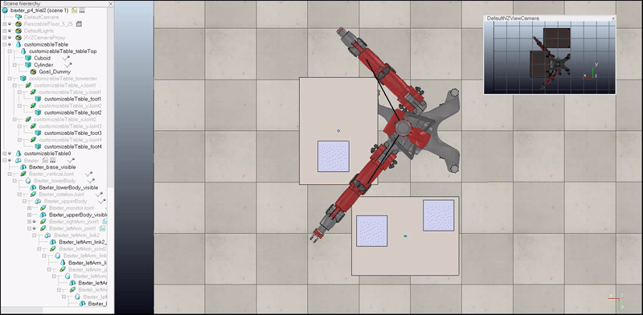

# Project - Pick and Place Application using Baxter Arm

* This project implements a simple Pick and Place application using Baxter Arm
* The arm picks up a cylindrical object and Places it at the target location
* The arm avoids the blocks during its operation

## Dependencies
* minimum VREP 3.5.0 and above

## Execution
Open and Simulate the `scene/baxter_p4_submission.ttt` using VREP

## Results 
The result can be found in the `output/project_4_submission.avi`

## See how it works

<em>Baxter arm Picking up a cylindrical object and placing it</em>

